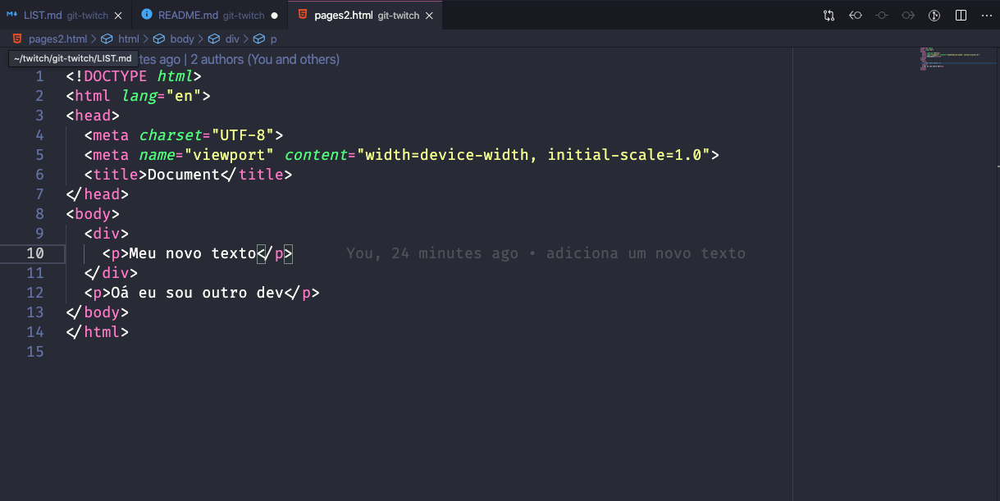

<h1 align="center">
  
</h1>

<h4 align="center">
  Git Twitch
</h4>
<p align="center">
  

  

  

  <a href="https://www.linkedin.com/in/lineu-pastorelli-5165a7186">
    
  </a>
</p>

## 📚 Projeto 

Uma explicação feita em live na Twitch mostrando mais na pratica como é usado o git, o que é e também sobre github.

<h1 align="center"> 
  
</h1>

## 🖥 Tecnologias

Esse projeto foi construido usando as seguintes tecnologias:

* [Git](https://git-scm.com)
* [Github](https://www.github.com)

## 🔖 Layout

<p align="center">
  <h3 align="center">Esse é meu layout</h3>
  
</p>

## ❓ Como usar

Basta clonar esse projeto e estudar sobre git para enteder como funciona esse tecnologia, e também como trabalhar codando em equipe =)

### Linhas de comando:

```bash
# Clone esse projeto
$ git clone https://github.com/lineuxyz/git-twitch

# Rode algo para instalar as depencias
$ npm install
```

## 🤔 Como contribuir

* Faça uma issue para treinar;
* Clone o projeto e faça uma alteração;
* Tente fazer um pull request nesse projeto.
  
## 📜 Licença

Esse projeto tem uma licença MIT. Veja a licença em [LICENSE](LICENSE.md)

---

Feito com ❤️ por [Lineu Pastorelli](https://www.linkedin.com/in/lineu-pastorelli-5165a7186)